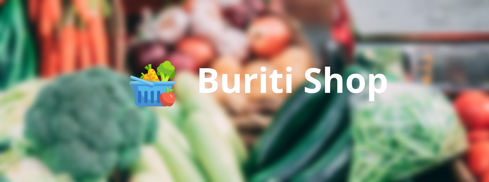

# Buriti Shop

Nosso projeto visa criar uma loja online para venda de produtos feita pela população ribeirinha da Amazônia.

## Objetivo

Nos pretendemos criar uma loja online livre para ajudar a população ribeirinha a escoar seus produtos cultivados e produzidos.

## Tecnologias utilizadas

- [Flask](https://flask.palletsprojects.com/en/2.2.x/)
- [Bootstrap](https://getbootstrap.com/)

## Equipe

- [Lucas Barros](lucas16070011@aluno.cesupa.br)
- [Nícolas Rocha](nicolas19070016@aluno.cesupa.br)
- [Paula Martins](paula19070021@aluno.cesupa.br)

## Licença

Este projeto está licenciado sob a ISC License - Veja o arquivo [LICENSE](./LICENSE) para mais detalhes.

## Créditos

- **Orientador:** Prof. Marcos Paulo
- **Instituição:** Cesupa ARGO
- **Ícones:** [Fruits and vegetables icons created by wanicon - Flaticon](https://www.flaticon.com/free-icons/fruits-and-vegetables), [Pessoas ícones criados por Freepik - Flaticon](https://www.flaticon.com/br/icones-gratis/pessoas)
